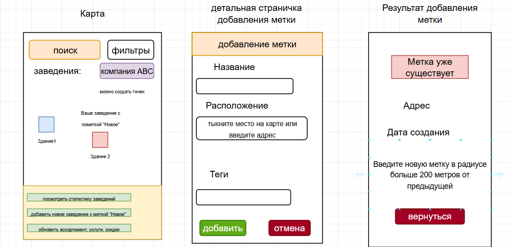

# B2B2С проект "Живой Район"

## Elevator Speach
Люди в районах постоянно теряют время и деньги из‑за неактуальных данных на картах — новое кафе уже открылось, а его нет, пробка у ТЦ — а никто не предупредил.

Мы — «Живой Район» — небольшая карта именно вашего района, где показывается только самая свежая информация.

В отличие от Яндекс Карт и 2ГИС, мы не собираем данные со всего города, а получаем их напрямую от местных бизнес-партнёров в реальном времени.

Пользователи экономят время и деньги — видят акции, новые места и пробки до выхода из дома.

А бизнес получает приток реальных посетителей, платя только за видимость там, где это действительно важно — в своём районе.

## Lean Canvas для B2B2C «Карта района»

### 1. Сегменты

**Бизнес-партнеры (B2):**
- Кафе, рестораны, магазины, салоны красоты
- ТЦ, стрит-ритейл
- Парковки и операторы трафика

**Пользователи-клиенты (C):**
- Жители района
- Посетители (работа, покупки)
- Курьеры, таксисты

**Внутренние работники (B1):**
- Модераторы, B2B-менеджеры


***Ранние последователи***
**Бизнес-партнеры (B2):**
- недавно открывшееся заведение
- небольшие бизнесы с маленьким доходом

**Пользователи-клиенты (C):**
- Туристы
- Люди, недавно переехавшие в этот район
- Курьеры из различных местных магазинов

### 2. Проблемы

**У бизнеса (B2):**
- Новое заведение открылось — никто не знает
- Пробка у парковки / входа отпугивает клиентов — нельзя предупредить
- Нет инструмента сообщить жителям района об акции «здесь и сейчас»
- Реклама в больших картах (2ГИС, Яндекс) дорогая и негибкая

**У потребителей (C):**
- Не видно, что нового появилось в районе
- Влипают в пробки / перекрытия без локальных оповещений
- Нет единой карты с состоянием района (еда, трафик, события)

### 3. Уникальное ценностное предложение (UVP)

**«Карта, где бизнес сам отмечает свои изменения (открытие, пробку, акцию), а жители видят это мгновенно и бесплатно. Никакой мёртвой карты — только живой район».**

Для B2: локальный канал до активной аудитории по модели pay‑to‑be‑seen.  
Для C: бесплатная карта в реальном времени без рекламных баннеров.

### 4. Решение

**Для бизнеса (B2):**
- Личный кабинет с отметками на карте
- Тарифы:
  - «Событие» (разовая публикация: открытие / пробка)
  - «Присутствие» (ежемесячная подписка)
  - «Приоритет» (push + выделение)

**Для жителей (C):**
- Карта с фильтрами («новое», «пробки», «акции сегодня»)
- Push-уведомления по подписке на район (бесплатно)

### 5. Каналы привлечения

**Для B2 (продажи):**
- Прямые продажи: менеджеры по районам
- Партнёрство с ТСЖ, УК, бизнес-центрами

**Для C (виральный рост):**
- QR-коды у входов в новые заведения
- Чаты и соцсети районов
- ASO (App Store / Google Play) по запросу «карта района новое»

### 6. Доходные потоки

**От B2 (бизнеса):**
- Ежемесячная подписка за присутствие на карте
- Плата за событийные метки состояния («Новое», «Пробка»)
- Подписка для бизнеса с различными уровнями, от которых зависит функционал (количество push уведомлений, количество меток дополнительных и так далее)
- 

**От С (клиентов):**
В основном беспоатные, но можно добавить различные премиум функции, например:
- «История района»: что изменилось за последний месяц в ваших любимых местах
- «Детектор выгод»: push, когда рядом с вами начинается акция


### 7. Ключевые метрики

- % бизнесов района в базе (охват B2) - главный KPI
- DAU / MAU среди C по району
- Доля активных публикаций от бизнеса за неделю («живая карта»)
- LTV бизнеса / CAC (стоимость привлечения одного заведения)
- Соотношение: жалобы на ложные метки / общее число меток

### 8. Расходы

- Разработка карты в реальном времени
- B2B-менеджеры по работе с бизнесом (ключевая статья)
- Хостинг, картографический движок, push-инфраструктура
- Модерация (на старте - ручная, в будущем можно сделать на основе нейросетей)

### 9. Скрытое преимущество (Unfair Advantage)

- **Первыми собранные локальные данные** - бизнес не уйдёт, так как C привыкнут к карте
- **Сетевой эффект:** больше C -> больше B2 готовы платить -> больше данных -> больше C
- **Территориальный замок:** агрегаторам сложно копировать район за районом вручную


## User stories

Рассмотрим возможные user stories и оценим их важность по метрике MoSCoW


### Роли
| Роль | Тип | Описание |
|------|-----|----------|
| **Житель / Посетитель (C)** | Конечный пользователь | бесплатно смотрит карту, подписывается на уведомления |
| **Бизнес (B2)** | Платящий клиент | добавляет метки «Новое», «Пробка», «Акция» |
| **Администратор (B1)** | Внутренняя роль | модерирует метки, управляет тарифами |

| Роль | Описание | Приоритеты по MoSCoW |
|------|----------|--------------------|
C | Я хочу **видеть на карте новые заведения** (открытые за последние 7 дней). | **M** |
C | Я хочу **видеть самые популярные заведения** (наибольшее количество посещений за последний месяц). | **S** |
C | Я хочу **видеть на карте новинки и акции, которые предлагают заведения**. | **M** |
C | Я хочу **видеть проблемы на дороге**, которые отметил бизнес. | **M** |
C | Я хочу **фильтровать карту** по категориям («еда», «пробки», «новое»). |**S** |
C | Я хочу **подписаться на push‑уведомления** о новинках и трафике в моём районе. | **M** |
C | Я хочу **оставлять обратную связь**, когда замечу какую-либо проблему. | **M** |
C | Я хочу **рейтинговую таблицу по заведениям**. | **C** |
C | Я хочу **видеть рейтинг заведения** и **изменять рейтинг бизнеса, который я уже посетил, оставить комментарий о бизнесе**. | **S** |
B2 | Я хочу **добавить метку «Новое заведение»** с часами работы и фото. |**M** |
B2 | Я хочу **отметить проблему на пути** и предложить альтернативный маршрут. | **M** |
B2 | Я хочу **видеть статистику** (сколько просмотров, построенных маршрутов). | **M** |
B2 | Я хочу **запустить приоритетный push** в радиусе 200 м. | **M** |
B2 | Я хочу **редактировать метку в реальном времени** (часы работы, статус). | **S** |
B2 | Я хочу **иметь стабильную систему подписки**, чтобы поддеривать стабильный приток клиентов | **M** |
B1 | Я хочу **подтверждать или отклонять метки** (борьба со спамом). | **S** |
B1 | Я хочу **видеть аналитику по районам** (активные бизнесы, жалобы). | **S** |
B1 | Автоматически отклонять дубликаты (название + 50 м) | **С** |
---

## MVP:
- Возможность видеть на карте новые заведения
- Возможность видеть на карте новинки и акции, которые предлагают заведения.
- Возможность видеть проблемы на дороге. 
- Возможность бизнесам отправлять push‑уведомления о новинках и трафике в районе.
- Возможность оставить обратную связь.
- Возможность видеть самые популярные заведения
- Возможность видеть и изменять рейтинг заведения, которое было посещено, оставить комментарий о бизнесе
- Возможность добавить метку «Новое заведение»
- Возможномть отметить проблему на пути
- Возможность видеть статистику бмзнесов
- Возможность видеть аналитику по районам
- Возможность фильтровать карту
- Реализовать стабильную систему подписки

## MLP:
- Возможность редактировать метку в реальном времени
- Реализовать рейтинговую таблицу по заведениям
- Возможность подтверждать или отклонять метки

## Разберем пару ключевых MVP:
## MVP 1: Возможность видеть на карте новинки и акции, которые предлагают заведения.

### Функциональные требования (ФТ)

| ID | Требование |
|----|-------------|
| ФТ-1.1 | Бизнес создаёт акцию через ЛК: текст (до 100 символов), тип скидки (процент / фикс / «подарок»), время действия (от 1 часа до 7 дней), геозона (радиус 200 м / 500 м / весь район) |
| ФТ-1.2 | Акция автоматически удаляется с карты после истечения времени действия |
| ФТ-1.3 | Пользователь видит на карте иконку акции (отличается от обычной метки) — например, |
| ФТ-1.4 | При клике на иконку открывается карточка: название заведения, условия акции, оставшееся время действия, кнопка «Доехать» (маршрут) |
| ФТ-1.5 | Фильтр «Акции сегодня» показывает только заведения с активными акциями |
| ФТ-1.6 | Одно заведение может иметь не более 2 активных акций одновременно |
| ФТ-1.7 | Пользователь не может увидеть одну и ту же акцию чаще 1 раза за 30 минут (без повторного клика) |
| ФТ-1.8 | Приоритетный push об акции отправляется только с согласия пользователя (C) и не чаще 1 раза в день |

### Нефункциональные требования (НФТ)

| ID | Требование |
|----|-------------|
| НФТ-1.1 | Время от публикации акции бизнесом до появления на карте у C — не более 5 минут (автоматическая модерация на проверенных B2) |
| НФТ-1.2 | Акции кэшируются на устройстве C не более чем на 15 минут (чтобы не показывать истёкшие) |
| НФТ-1.3 | Синхронизация времени — серверное, акция исчезает ровно в секунду окончания (погрешность ±2 секунды) |
| НФТ-1.4 | Иконка акции не перекрывает другие важные метки (пробки, новые заведения) — приоритет: пробка > новое > акция |
| НФТ-1.5 | Поддержка часовых поясов — акция действует по местному времени района |


## MVP 2: Возможность видеть на карте новые заведения
### Функциональные требования (ФТ)

| ID | Требование |
|----|-------------|
| ФТ-2.1 | Бизнес добавляет метку через ЛК: название, категория, адрес (геопозиция), часы работы, до 5 фото, описание (до 500 символов) |
| ФТ-2.2 | После модерации метка получает флаг `is_new = true` и дату модерации |
| ФТ-2.3 | Пользователь видит иконку «Новое» для заведений с `is_new = true` не старше 7 дней |
| ФТ-2.4 | При клике на метку открывается карточка с фото, часами работы, описанием, кнопкой «Доехать» |
| ФТ-2.5 | Через 7 дней флаг `is_new` автоматически снимается, метка становится обычной (если бизнес продлил подписку) |
| ФТ-2.6 | В карточке заведения всегда видна дата открытия (пользователь знает, что это «бывшее новое») |
| ФТ-2.7 | Пользователь может отфильтровать карту на «Только новые» (скрыть все обычные метки) |
| ФТ-2.8 | При первом заходе в район пользователь получает push «Здесь появилось 3 новых заведения за неделю» |

### Нефункциональные требования (НФТ)

| ID | Требование |
|----|-------------|
| НФТ-2.1 | Время от подтверждения модерации до появления метки на карте всех C — не более 2 минут |
| НФТ-2.2 | Метка «Новое» автоматически исчезает ровно через 7 дней ± 1 час (с учётом времени модерации) |
| НФТ-2.3 | Фото заведения сжимаются до 3 размеров (1280, 640, 320 px), загрузка не более 2 секунд на медленном интернете |
| НФТ-2.4 | Геопозиция метки должна отображаться на карте с точностью до 15 метров |
| НФТ-2.5 | Доступность для скринридеров: иконка «Новое» должна быть подписана для VoiceOver/TalkBack |

# Доменные зоны (DDD) — «Живой Район»

## 1. Карта и метки (Map & Listings)

**Что делает:** показывает бизнесы на карте, фильтрует, ищет рядом.

**User Stories (из вашего списка):**

| ID | User Story |
|----|-------------|
| C1 | Я хочу **видеть на карте новые заведения** (открытые за последние 7 дней). |
| C3 | Я хочу **видеть на карте новинки и акции, которые предлагают заведения**. |
| C4 | Я хочу **видеть проблемы на дороге**, которые отметил бизнес. |
| C5 | Я хочу **фильтровать карту** по категориям («еда», «пробки», «новое»). |
| B2-1 | Я хочу **добавить метку «Новое заведение»** с часами работы и фото. |
| B2-2 | Я хочу **отметить проблему на пути** и предложить альтернативный маршрут. |
| B2-5 | Я хочу **редактировать метку в реальном времени** (часы работы, статус). |
| C9-1 | Я хочу **видеть рейтинг заведения** |

**Глоссарий:**

| Термин | Смысл |
|--------|-------|
| place_name | Заведение на карте (кафе, магазин, пробка) |
| place_date | время создания метки заведения на карте |
| place_location | местоположение заведения на карте |
| place_date | дата создания метки заведения |
| new_place | Метка на 7 дней, показывающая, что заведение открылось недавно |
| place_assortment | Предложения бизнеса (скидки, подарки) |
| place_trubble | Метка, созданная бизнесом, указывающая на проблемы с перемещением в данном месте |
| filter | Ограничение показа по типу («еда», «пробки», «новое») |
| places_list | список заведений, ограниченных по какому-то признаку |

---

## 2. Бизнес и подписка (Business & Subscription)

**Что делает:** управляет аккаунтами бизнеса, подписками, статистикой, платными push.

**User Stories (из вашего списка):**

| ID | User Story |
|----|-------------|
| B2-3 | Я хочу **видеть статистику** (сколько просмотров, построенных маршрутов, количество заведений). |
| B2-4 | Я хочу **запустить приоритетный push** в радиусе 200 м. |
| B2-6 | Я хочу **иметь стабильную систему подписки**, чтобы поддерживать стабильный приток клиентов. |
| C8 | Я хочу **рейтинговую таблицу по заведениям**. |

**Глоссарий:**

| Термин | Смысл |
|--------|-------|
| business_name | Платящий клиент (кафе, ТЦ, магазин) |
| business_val | Количество заведений у одной компании |
| business_places_val | количество возможных меток у одной компании |
| business_push | Платное уведомление в радиусе 200 м, за которое платит бизнесс |
| business_subscription | Уровень подписки бизнеса |
| business_clients | Измеримый результат — количество переходов по маршруту |
| business_rating_table | Топ заведений района (по рейтингу или популярности) |

---

## 3. Жители и обратная связь (Users & Feedback)

**Что делает:** регистрирует жителей, собирает оценки, комментарии, жалобы, подписки на push.

**User Stories (из вашего списка):**

| ID | User Story |
|----|-------------|
| C2 | Я хочу **видеть самые популярные заведения** (наибольшее количество посещений за последний месяц). |
| C6 | Я хочу **подписаться на push‑уведомления** о новинках и трафике в моём районе. |
| C7 | Я хочу **оставлять обратную связь**, когда замечу какую-либо проблему. |
| C9 | Я хочу **видеть рейтинг заведения** и **изменять рейтинг бизнеса, который я уже посетил, оставить комментарий о бизнесе**. |

**Глоссарий:**

| Термин | Смысл |
|--------|-------|
| client | Пользователь приложения |
| client_feedback | Жалоба на проблему или недостоверную метку |
| business_rating | Оценка 1–5 звёзд от жителей |
| client_commentary | Текст к рейтингу |

---

## 4. Модерация и аналитика (Moderation & Analytics)

**Что делает:** проверяет метки, банит спамеров, даёт отчёты, автоматически ищет дубликаты.

**User Stories (из вашего списка):**

| ID | User Story |
|----|-------------|
| B1-1 | Я хочу **подтверждать или отклонять метки** (борьба со спамом). |
| B1-2 | Я хочу **видеть аналитику по районам** (активные бизнесы, жалобы). |
| B1-3 | **Автоматически отклонять дубликаты** (название + 50 м). |

**Глоссарий:**

| Термин | Смысл |
|--------|-------|
| admin | Внутренний сотрудник |
| approved_places | Одобрение «Нового заведения» или акции |
| declined_places | Отказ (спам, дубликат, фейк) |
| district_stat | Отчёт: активные бизнесы, жалобы, количество меток |

---

# BDD разработка приложения:
Рассмотрим разработку подобного типа на примере одного из моих MVP. В качестве примера возьмем следующее:
**Возможность добавить метку «Новое заведение»**

Рассмотрим разные сценарии при добавлении двух меток

### Сценарий 1: Успех — добавление двух меток

```gherkin
Дано:
  - Бизнес-партнёр авторизован в приложении
  - У его аккаунта есть тариф, разрешающий 2 активные метки «Новое заведение»
  - На детальной статистике он видит: "доступно меток: 2 из 2"
  - Первая метка ещё не установлена
Когда:
  - Он нажимает «Добавить метку»
  - Выбирает на карте место для метки
  - Заполняет все поля
  - Нажимает «Подтвердить»
Тогда:
  - На карте появляются две метки «Новое заведение» с одинаковым названием
  - В детальной статистике отображается: "активных меток: 2, доступно: 0"
  - Обе метки получают флаг `is_new = true` на 7 дней
  - Обе метки привязаны к одному `business_id`
  - Модератор получает две заявки на проверку
```

### Сценарий 2: Провал — добавление двух меток
```gherkin
  Дано:
  - Бизнес-партнёр авторизован в приложении
  - У его аккаунта есть тариф, разрешающий 2 активные метки «Новое заведение»
  - На детальной статистике он видит: "доступно меток: 2 из 2"
  - Первая метка уже установлена в выбранном месте 
Когда:
  - Он нажимает «Добавить метку»
  - Выбирает на карте место для второй метки в том же месте, что и первая, или очень близко с ней
  - Заполняет все поля
  - Нажимает «Подтвердить»
Тогда:
  - Вторая метка НЕ создаётся
  ```

# Wireframing: примерные фреймы, которые мы получаем в результате разработки критического пути в BDD



# API-First: ракссмотрим 2 ручки по данным сценариям

## 1 ручка - получаем информацию о подписке бизнес аккаунта и количестве возможных меток

(Это нужно для певрого фрейма)

GET /api/v1/business/stats

```json
    {
      "business_name" = String;
      "business_val" = int;
      "business_places_val" = int;
      "places_list" = {
        "places_name" = String;
        "place_location" = String;
        "place_date" = String;
      }
    }
```


## 2 ручка -  заполняем информацию о новой точке

POST /api/v1/business/listings/new-place


```json
  input
    {
        "places_name" = String;
        "place_location" = String;
        "place_tags" = {String;};
    }

    output
    200
    400 {error: "Поля неправильно заполнены"}
```